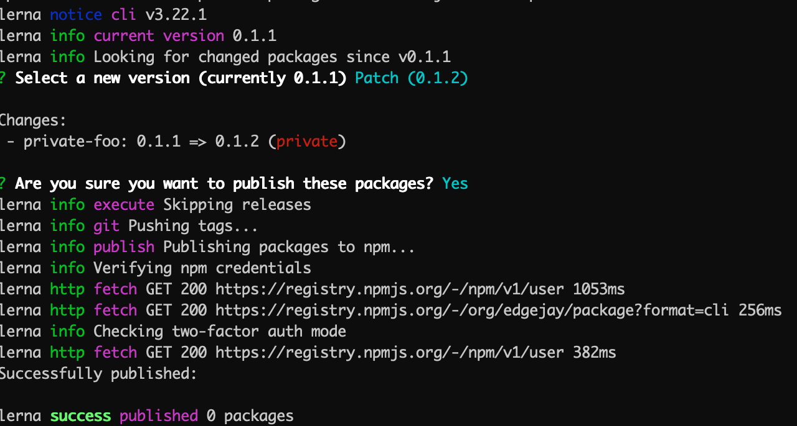
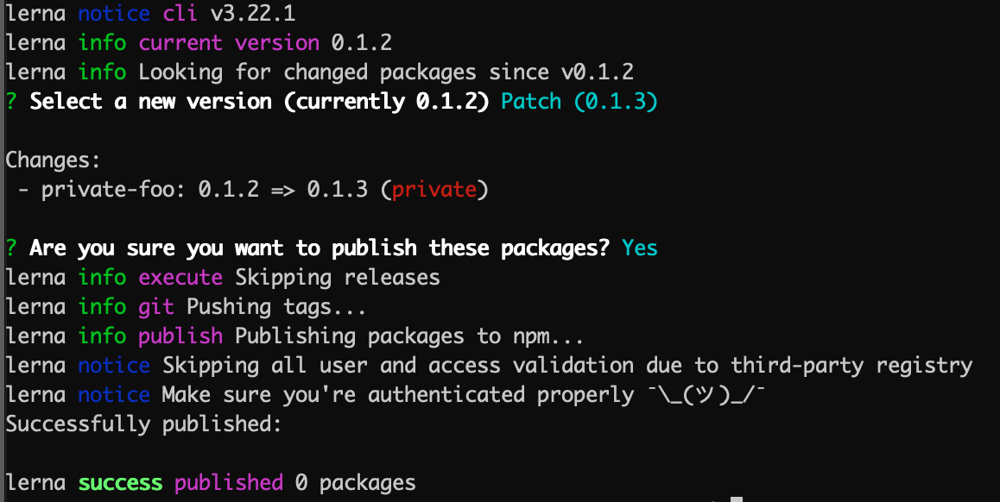

# lerna-private-packages-test
Test and make sure Lerna private packages do not get published into npm

Packages are created using `lerna create`.

## Changes implemented to make sure package is private

### package.json

Alter or add `private` field value to true. Although lerna logins to npm, package is not published as it is marked as `private`.

### Fake registry

You can also use "fake" registry URLs to trick lerna into assuming that 3rd party registry is accessed with proper authentication, thus preventing packages from published to npm.

